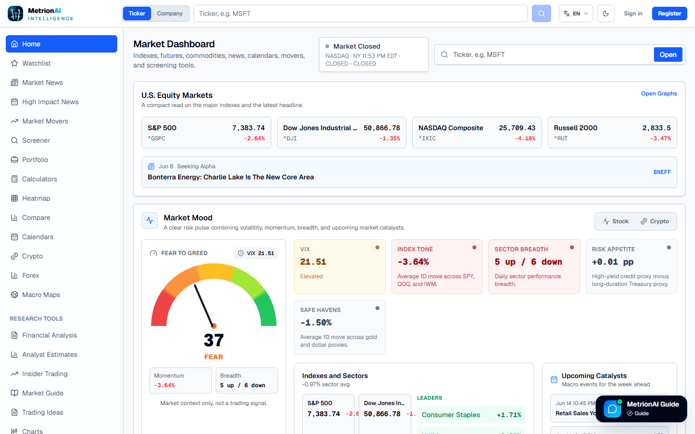
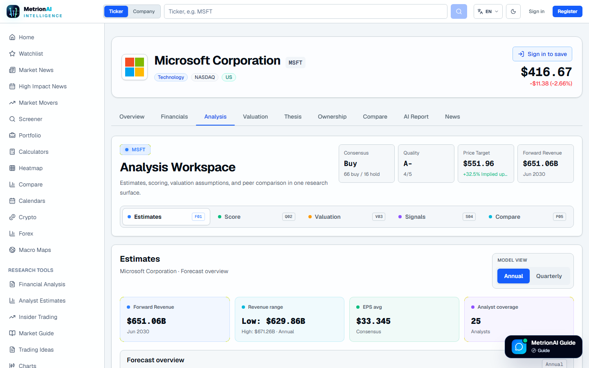
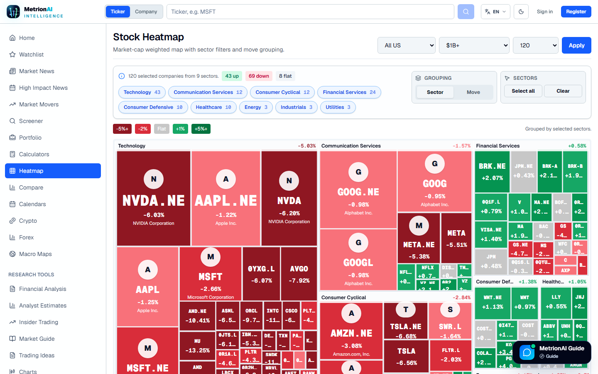
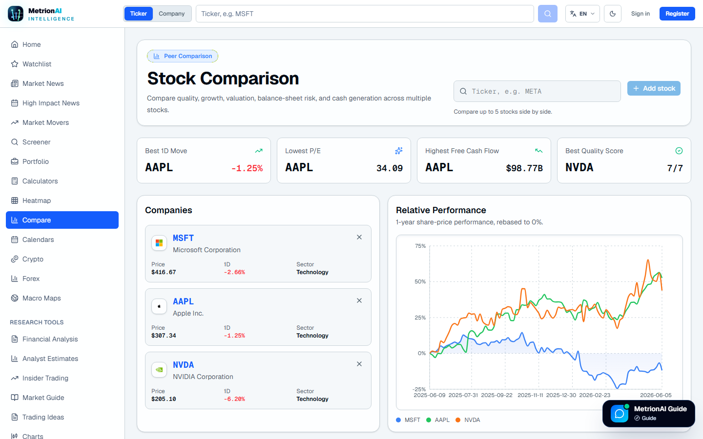

<h1 align="center">Matan Swisa</h1>

  <strong>Full-Stack Software Developer</strong> 
  Building polished products with React, TypeScript, Node.js, FastAPI, ASP.NET Core, PostgreSQL, and SQLite.

  
  
  
  
  

---

## About Me

I build full-stack web applications across frontend, backend, and data layers. Most of my work lives in practical product spaces: dashboards, map-based tools, dynamic forms, authenticated workflows, and API-driven systems.

I care about clear API contracts, clean UI states, typed code, readable project structure, and projects that are easy to run, maintain, and extend.

## Selected Projects

### Street Food Trucks 🍔

A map-based food truck platform built for discovery, filtering, editor workflows, and a more interactive browsing experience.

  

<table>
  <tr>
    <td><strong>Frontend</strong></td>
    <td>React, TypeScript, Redux Toolkit, OpenLayers, Vite</td>
  </tr>
  <tr>
    <td><strong>Backend</strong></td>
    <td>NestJS, TypeORM, REST APIs, role-aware endpoints</td>
  </tr>
  <tr>
    <td><strong>Data</strong></td>
    <td>SQLite, seeded domain data, truck location records</td>
  </tr>
  <tr>
    <td><strong>Product Work</strong></td>
    <td>Filtering, map markers, editor/viewer roles, CRUD flows, assistant UI</td>
  </tr>
</table>

### Customer Transactions Dashboard 📊

A full-stack dashboard for browsing customers and reviewing transaction activity, with searchable records, direct detail views, summary metrics, masked card numbers, and normalized status badges.

  

  

<table>
  <tr>
    <td><strong>Frontend</strong></td>
    <td>React, TypeScript, React Router, Recoil, styled-components</td>
  </tr>
  <tr>
    <td><strong>Backend</strong></td>
    <td>Node.js, Express, REST API</td>
  </tr>
  <tr>
    <td><strong>Workflow</strong></td>
    <td>Docker Compose, direct routes, searchable tables, summary cards</td>
  </tr>
</table>

### Dynamic Form Platform 🧩

A schema-driven form platform that renders UI from JSON, validates input on the client, and persists submissions through a FastAPI backend with PostgreSQL.

  

  

  

<table>
  <tr>
    <td><strong>Frontend</strong></td>
    <td>React, Vite, Material UI, Formik, Yup</td>
  </tr>
  <tr>
    <td><strong>Backend</strong></td>
    <td>FastAPI, SQLAlchemy, Pydantic, PostgreSQL</td>
  </tr>
  <tr>
    <td><strong>Product Work</strong></td>
    <td>Schema-based form rendering, validation, persisted submissions, Dockerized client/API/database workflow</td>
  </tr>
</table>

[Combined Repository](https://github.com/matanswisa/dynamic-form-platform-)

### Pulp Repository Management ⚙️

Open-source work around Pulp repository management, focused on Debian publishing flows, mirror probing endpoints, and UI support for distribution setup and client bootstrap automation.

<table>
  <tr>
    <td><strong>UI Work</strong></td>
    <td>Repository publishing actions, Debian distribution flows, generated APT source lines, bootstrap script integration</td>
  </tr>
  <tr>
    <td><strong>Backend Work</strong></td>
    <td>Custom Pulpcore endpoints for mirror probing, Debian metadata discovery, signing-service bootstrap support, npm compatibility patches</td>
  </tr>
  <tr>
    <td><strong>Stack</strong></td>
    <td>React, PatternFly ecosystem, Python, Docker, Pulpcore, Debian repository workflows</td>
  </tr>
</table>

[UI Repository](https://github.com/matanswisa/pulp-ui-prod) · [Backend Repository](https://github.com/matanswisa/pulp-backend-production)

## Engineering Toolbox 🛠️

| Area | Tools |
|---|---|
| Frontend | React, TypeScript, JavaScript, Vite, Create React App, Material UI, Redux Toolkit, Formik, Yup, OpenLayers |
| Backend | Node.js, NestJS, FastAPI, ASP.NET Core, REST APIs, Swagger/OpenAPI |
| Data | PostgreSQL, SQLite, SQLAlchemy, TypeORM |
| Practices | API design, validation, authentication, authorization, pagination, reusable UI components, Docker workflows, testable code |

## Current Focus

I am currently building [MetrionAI](https://github.com/matanswisa/stocks-analysis), a modern market intelligence workspace for stock research, chart analysis, financial statements, watchlists, screeners, heatmaps, portfolio tracking, company comparison, and AI-assisted thesis workflows.

The goal is to turn market data into a focused research flow: scan the market, open a company, study fundamentals, compare peers, inspect technical context, follow news, and build a clearer investment thesis.

**Live app:** [metrionai.com](https://metrionai.com/)

  

  

  
  

Current product work focuses on making the platform clearer, faster, and more useful for real research: stronger financial analysis pages, cleaner mobile UX, deeper portfolio tracking, better charting workflows, and practical AI-assisted thesis tools.
